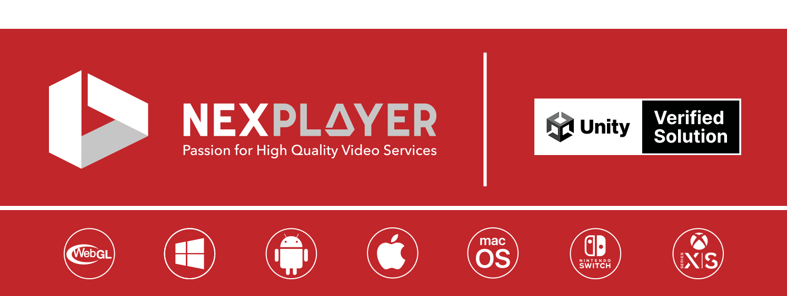
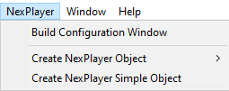
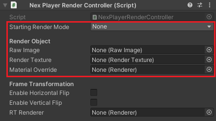
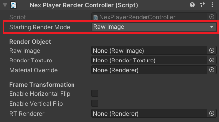
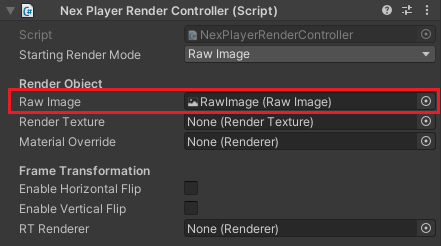
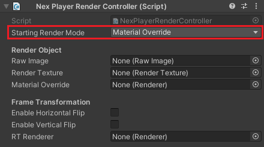
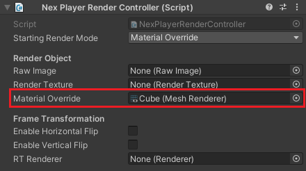
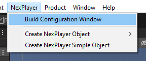
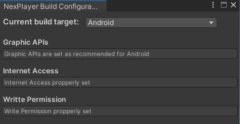
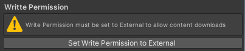

<h1 style="line-height:2;"><p align="center"><a href="https://www.nexplayersdk.com/unity-player-sdk-demo/?utm_source=github&utm_medium=referral&utm_campaign=unitygithub&utm_content=20200211--unitydemocontact" target="_blank"></img></a>
<a align=right href="https://www.nexplayersdk.com/unity-player-sdk-demo/?utm_source=github&utm_medium=referral&utm_campaign=unitygithub&utm_content=20200211--unitydemocontact" target="_blank"></a>
</p></h1>

</br>

<p align="center" style="border-style:solid"><a rel="noopener noreferrer"></a>

NexPlayer™ for Unity is a cross-platform video streaming player for Unity games and apps that supports both regular and 360 video playback on Android, iOS, Windows, macOS, Nintendo Switch™, Xbox One S/X, Xbox Series X/S, VR Headsets, UWP(Universal Windows Platform) HoloLens and WebGL. NexPlayer's Unity video plugin is the only player supporting **Widevine DRM-protected** HLS & DASH streaming on **Android & iOS devices.**

This repository contains the NexPlayer™ Unity video streaming player plugin features list as well as an installation guide. If you want to get a copy of our fully working demo, contact us at our [website](https://www.nexplayersdk.com/unity-player-sdk-demo/?utm_source=github.com&utm_medium=referral&utm_campaign=unitygithub&utm_content=20200211--unitydemocontact).

## Demo Examples

<p style="margin-left:auto;margin-right:auto" width="300px" align="left">Our Unity video plugin allows the introduction of new exciting scenes within your Unity projects. With our plugin, you can use in-game actions and objects to modify video content.</p>
 
<p align="center" style="border-style:solid"><a rel="noopener noreferrer"></a>
</p> 
<p align="center"><b>Render videos on any Unity GameObject</b></p> 
<br> 
 
<p align="center" style="border-style:solid"><a rel="noopener noreferrer"></a>
 </p> 
<p align="center"><b>Multi Streaming</b></p><br> 

## [Our Unity Use Cases](https://nexplayersdk.com/contact-nexplayer-metaverse/)

| | |
|:-------------------------:|:-------------------------:|
 Pluto TV: Immersive experience in VR|  PartyOn: Immmerse in the music metaverse|
 GREE, Inc.: Virtual cinema platform| WebGL: Browser-based metaverses, NFT items, blockchain|

## Table of Contents

* **[Features](#features)**  

* **[Supported Platforms](#supported-platforms)**

* **[Demo Installation Guide](#demo-installation-guide)**
 
 <br> 

## Features

The NexPlayer™ for Unity video streaming player plugin contains the latest features. As our Unity video plugin is developed entirely in-house, we can implement any desired functionalities. 

We support the following features:

<table>
 <tbody style="text-align:center;">
   <tr>
     <td valign="top" style="text-align:center;">
         <p style="max-width:100%;"><b>Overview</b></p>
     </td>
     <td>
       <ul>
       <li>mp4 download and playback</li>
       <li>HLS & DASH Streaming with ABR (Adaptive Bitrate)</li>
       <li>AES-128 HLS</li>
       <li>Widevine DRM for Streaming and Local Playback for Android & iOS</li>
       <li>Server-Side & Client-Side Ad Insertion</li>
       <li>Windows & macOS Editor (Easy to Use)</li>
       <li>Up to 8K (UHD) Resolution</li>
       <li>Rendering Videos on 2D & 3D Objects</li>
       </ul>
     </td>
        <tr>
            <td valign="top" style="text-align:center;">
            <p style="max-width:100%;"><b>Basic Features</b></p>
     </td>
     <td>
       <ul>
        <li>Auto Playback</li>
        <li>Play / Pause</li>
        <li>Seek</li>
        <li>Audio Volume Adjustment</li>
        <li>Loop Playback</li>
        <li>Configurable Aspect Ratio</li>
        <li>Portrait / Landscape Orientation</li>
       </ul>
     </td>
     </tr>
     <tr>
        <td valign="top" style="text-align:center;">
        <p style="max-width:100%;text-align:center;"><b>Advanced Features</b></p>
         </td>
     <td>
       <ul>
       <li>Adjustable Buffering Time</li>
       <li>Offline Streaming Playback for HLS & DASH</li>
       <li>MultiView (Display Multiple Synchronized Streams): Android & iOS only</li>
       <li>WebVTT Subtitles & CEA-608/708 Closed Captions</li>
       <li>Multiple Audio & Subtitle Track Selection</li>
       <li>Spread Video Across Multiple Objects</li>
       <li>Content Information and Statistics (Audio & Video Bitrate, Codec, Average FPS, etc.)</li>
       <li>Transparency and Chroma Support</li>
        <li>Metadata: ID3 tags</li>
        <li>Audio PCM data</li>
        <li>AudioSource piping to Unity</li>
       </ul>
     </td>
     </tr>
      <tr>
        <td valign="top" style="text-align:center;">
        <p style="max-width:100%;"><b>360 Video Playback and Virtual Reality (VR)</b></p>
         </td>
     <td>
       <ul>
       <li>Touch input which includes movement, and camera rotation</li>
       <li>Gyroscope input to move the camera</li>
       <li>Mouse input to move the camera</li>
       <li>Automatic Ground Leveler to stabilize the video</li>
       <li>Custom shaders to map 2D, 3D Over/Under and 3D Left/Right 360 videos</li>
       <li>Compatible with VR libraries for Unity (Google Cardboard, Vive & Oculus)</li>
       </ul>
     </td>
     </tr>
   </tr>
 </tbody>
</table>

## Supported Platforms

| Platform | Supported Graphics APIs | HLS | DASH | Local | Inside App (Streaming Assets) | DRM protection |
| :-----:| :-----:| :-----:| :-----:| :-----:| :-----:| :-----:|
| Android  | OpenGLES2, OpenGLES3 | :heavy_check_mark: | :heavy_check_mark: | :heavy_check_mark: | :heavy_check_mark: | :heavy_check_mark: |
| iOS | Metal | :heavy_check_mark: | :heavy_check_mark: | :heavy_check_mark: | :heavy_check_mark: | :heavy_check_mark: |
| Windows | DirectX11 / DirectX12 | :heavy_check_mark: | :heavy_check_mark: | :heavy_check_mark: | :heavy_check_mark: |
|macOS|Metal|:heavy_check_mark:||:heavy_check_mark:|:heavy_check_mark:|
|HTML 5|WebGL 1.0 / WebGL 2.0|:heavy_check_mark:|:heavy_check_mark:|||
|Nintendo Switch|NVN|:heavy_check_mark:|:heavy_check_mark:|||
|Xbox| DirectX11 / DirectX12 | :heavy_check_mark: | :heavy_check_mark: | :heavy_check_mark: | :heavy_check_mark: |
|HoloLens| DirectX11 / DirectX12 | :heavy_check_mark: | :heavy_check_mark: | :heavy_check_mark: | :heavy_check_mark: |
|[UWP](https://docs.microsoft.com/en-us/windows/uwp/audio-video-camera/supported-codecs)| DirectX11 / DirectX12 | :heavy_check_mark: | :heavy_check_mark: | :heavy_check_mark: | :heavy_check_mark: |


## Demo Installation Guide

<p>Create or open an <a href="https://unity3d.com/">Unity</a> project and import the NexPlayer™ Unity video streaming player plugin.</p>
</img>

### Using NexPlayerSimple

NexPlayerSimple is a slimmed down version of our full-featured example player,
NexPlayer. You can use it by following these steps:

1. To add video playback to your scene, you will need to add a NexPlayerSimple
component to your scene:
   1. Navigate to the NexPlayer menu and click "Create NexPlayer Simple
Object"
<br><p></img></p>
   2. This will add a new GameObject (NexPlayerSimple) to your scene,
which will contain the NexPlayerSimple component along with the
NexPlayerRenderController component.
2. NexPlayerSimple supports any of the three supported RenderModes
(RawImage, RenderTexture and Material Override). Using the inspector in the
NexPlayerRenderController component, select the desired Render Mode and
set the reference to that Render Object.
<br><p></img></p>

#### Example: Using Raw Image

1. Set the "Starting Render Mode" to Raw Image:
<br><p></img></p>
2. Create a Raw Image in your scene (GameObject → UI → Raw Image) and
drag and drop it onto the Raw Image field of the NexPlayerRenderController
component:
<br><p></img></p>
3. Start the scene and the video will play on the Raw Image.

#### Example: Using Material Override

1. Set the "Starting Render Mode" to Material Override:
<br><p></img></p>
2. Create a cube in your scene (GameObject → 3D Object → Cube) and drag
and drop it onto the Material Override field of the NexPlayerRenderController
component:
<br><p></img></p>
3. Start the scene and the video will play on the cube.

### Using NexPlayer

NexPlayer is our full-featured example player. You can use it by following this steps:

#### 1) Play Regular Video

<p>Create the NexPlayer_Manager GameObject by either using the NexPlayer Context Menu at the top or right clicking in the Hierarchy (Object Context Menu).</p>
</img><br>


<p>Create the NexPlayer_UI GameObject using the NexPlayer™ Context Menu.</p>
</img><br>


<p>Set NexPlayer_Manager references to the UI elements by clicking on the button "Set UI References".</p>
</img><br>


<p>Create the NexPlayer Samples Controller GameObject using the NexPlayer™ Context Menu.</p>
</img><br>


<p>Select any of the different samples provided by NexPlayer™.</p>
</img><br>


<p>Finally, Change the NexPlayer™ component inside NexPlayer_Manager with the desired stream settings.</p>


#### 2) Play a 360 Scene

Select the value Nex Player 360 for the Active Sample setting at the Samples Controller GameObject.


#### 3) Load Any NexPlayer™ Sample Demo

Select any of the following samples as the Active Sample setting at the Samples Controller GameObject.

```cs
- Raw Image
- Render Texture
- Transparency
- Video Spread
- Material Override
- Multiple Renderers 
- Change Render Mode
- NexPlayer360
- Multistream Raw Image  
- Multistream Render Texture  
```

Add the Scene to the list and switch to the desired platform.


### Platform Build Configuration

The NexPlayer™ Plugin for Unity provides the build configuration window to set the
build configuration for each platform in a fast and easy way.

Open the window by clicking in the top context menu NexPlayer/Build Configuration
Window.

</img>

The window automatically detects and informs of any conflicts regarding the build
configuration (graphics API, Internet settings...). The following messages will be shown if the build configuration is correct:

</img>

The following warning will be displayed if the build configuration is not correctly configured. The button will change the configuration automatically:

</img>

## Frequently Asked Questions

To view the FAQ proceed to the [Unity Support Page](https://support.unity.com/hc/en-us/sections/360011703472-NexPlayer-Verified-Solutions-Partner-)

-------------------


## Contact
[unity.support@nexplayer.com](mailto:unity.support@nexplayer.com)
<br>+34 914 184 356
<br>See you also at trade shows around the world!

<p align="center" style="border-style:solid"><a rel="noopener noreferrer"></a>

 
 
 
<br> 
</br>
 <p>

<sub><sup>Nintendo Switch is a trademark of Nintendo.</sup></sub>
<br>
<sub><sup>WebGL, Video Player WebGL, Unity Video Player on WebGL, Unity Video Player, playing video in unity, Play Video in Unity WebGL, HTML5 Video Player for Unity WebGL, Live Video in WebGL, 3D, UnityEngine.Video, UnityEngine.VideoModule, Unity Engine Video, VideoPlayer.renderMode, renderheads/unityplugin, Video Player component - Unity, Web3, web3 gaming and entertainment, blockchain, Cryptocurrency, Playing Video in Unity, Best VR Video Player for Unity, UnityEngine.VideoPlayer, UnityEngine.VideoClip, Metaverse, Advanced video playback for Unity, Unity Asset Store, Immersive 360 video experience, Augmented, Mixed, Virtual Reality, Oculus Quest, Oculus Quest2, Hololense Meta Quest, Gear VR, Google Cardboard, Daydream, HTC Vive Focus, Pico Goblin & Neo, EDM, Electronic Dance Music, Audio PCM data, Audio piping to Unity, Audio Source to Unity, Adding audio to your Unity scene, UWP, Windows, Playback raw PCM, How to play .pcm file, Gets PCM audio data, Unity3D, Amazon IVS Unity.</sub><sup>   
<sub><sup>Unity Xbox video player, Xbox One S, Xbox One X, Series X/S live, Xbox, PCM audio, Playing Video in Unity, Livestreaming the Metaverse, Can Streaming Video Keep Up with the Metaverse? can streaming video survive the metaverse, AR, VR, XR, Amazon Interactive Video Service, timed metadata, embed metadata, metadata, ID3 tags, audio source, audio output, timestamps, HMI - Human Machine interface, infotainment, Automotive. </sub><sup> 
