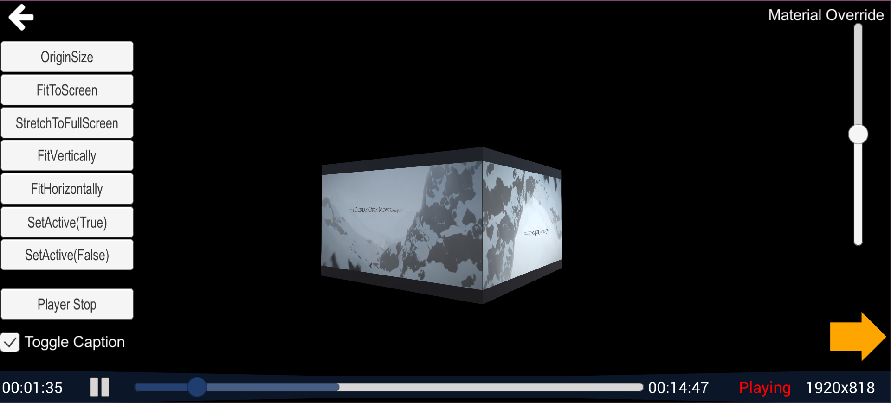
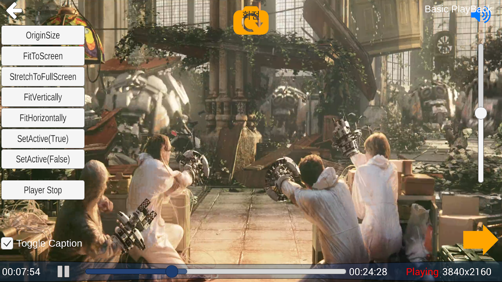
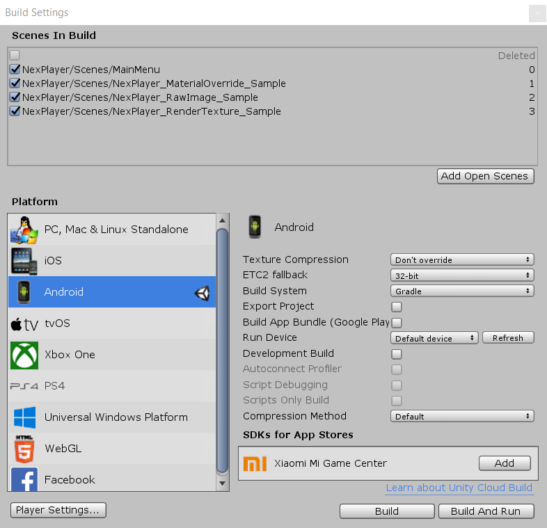
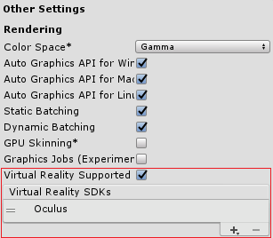

## NexPlayer™ Unity Video Streaming Plugin

<p align="center">  </p>

NexPlayer™ for Unity is a multiscreen video streaming player for Unity apps that supports both standard and 360 video playback across all Android, iOS and PC devices. NexPlayer™ for Unity is the only playback solution for Unity that supports HLS &amp; DASH live streaming with Widevine DRM across all Android & iOS devices.

This repository contains the NexPlayer™ video streaming plugin features list as well as an integration guide. If you want to get a copy of our fully working demo, contact us at our [website](https://www.nexplayersdk.com/contact?utm_source=github&utm_medium=organic&utm_campaign=unite&utm_content=20190918--unity).

* **[Features](#features-for-android--ioS)**  

* **[Supported Platforms](#supported-platforms)**

* **[NexPlayer360 Plugin](#nexplayer360-plugin)**

* **[Documentation](#documentation)**

* **[Integration Guide](#how-to-use-it)**




## Features for Android & iOS

The NexPlayer™ for Unity video streaming plugin contains the latest features. As our plugin is developed entirely in-house, we can implement any desired functionalities. 

We support the following features:

- HLS & DASH Streaming with ABR (Adaptive Bitrate)
- Complete API including:
    - Play / Pause
    - Seek
    - Portrait / Landscape Orientation
    - Audio Volume Adjustment
    - Loop Playback
    - Set Buffering Time
    - Ultra-Low Latency
- Useful Callbacks Including:
    - Content Information and Statistics (Audio & Video Bitrate, Codec & Average FPS, and More)
    - Change Audio & Caption Tracks
    - Offline Streaming Playback for HLS & DASH
    - Widevine DRM on Local Videos and Streaming for HLS & DASH
    - 360 Video Playback and Virtual Reality (VR)
    - SRT, SMI, & WebVTT Subtitles & CEA-608/708 Closed Captions 
    - Server-Side & Client-Side Ad Insertion
    - Up to 4K Ultra High Definition (UHD) Resolution 
    - Unity Versions 2017 or Higher


## Supported Platforms
| Platform | Supported Graphics APIs | HLS | DASH | Local | Inside App (Streaming Assets) |
| ------ | ------ | ------ | ------ | ------ | ------ |
| Android (armeabi-v7a and x86) | OpenGLES2, OpenGLES3 | O | O | O | O |
| iOS | OpenGLES2, OpenGLES3, Metal | O | O | O | O |
| Windows | DirectX11 | O | O | O | O |


## NexPlayer360™ Plugin
NexPlayer™ Plugin for Unity includes many of the same [NexPlayer360 SDK](https://www.nexplayersdk.com/360-video-player-sdk/), features such as:
- Touch input, including movement, zoom and rotation of the camera
- Gyroscope input to move the camera
- Mouse input to move the camera
- Automatic Ground Leveler to stabilize the video
- Custom shaders to map 2D, 3D Over/Under and 3D Left/Right 360 videos
- Customizable key controls
- VR supported scenes
- Compatible with VR libraries for Unity (Google Cardboard, Vive & Oculus)


## Documentation
Here is the official [documentation](Unity_Integration_Guide.pdf) for the NexPlayer™ Unity Video Streaming Plugin.


## How to use it


### Quick start
#### 1) Play standard video

Create a new [Unity](https://unity3d.com/) project and import the NexPlayer™ Video Streaming Plugin.


In order to load the player [Scene](https://docs.unity3d.com/Manual/UsingTheSceneView.html) follow the path: 'Assets/NexPlayer/Scenes' and open 'NexPlayer raw video.unity' by double clicking.
Test the playback by selecting the play button in the editor.



#### 2) Play a 360 scene

Load the 360 Video [Scene](https://docs.unity3d.com/Manual/UsingTheSceneView.html) available in 'Assets/NexPlayer/NexPlayer360/Scenes/NexPlayer360.unity'.
Test the playback by selecting the play button in the editor.


#### 3) Load NexPlayer™ demo

Add the following scenes to the Unity build:

- Assets/NexPlayer/Scenes/MainMenu.unity
- Assets/NexPlayer/Scenes/NexPlayer_MaterialOverride_Sample.unity
- Assets/NexPlayer/Scenes/NexPlayer_RawImage_Sample.unity
- Assets/NexPlayer/Scenes/NexPlayer_RenderTexture_Sample.unity

Switch to the desired platform.




#### 4) Configuration steps

Graphics APIs:
- Manually, select the compatible graphics APIs manually in the "Player Settings" section of Unity for each platform.
- If the helper component NexEditorHelper.cs is attached to any GameObject, it will include a graphics UI to
auto detect any conflict regarding the graphics API, and it will promptly solve it.

Android platform:
- To allow any remote video, select the "Require" value for "Internet Access" option in the Unity
player settings.
- Set "Write Permision" to External (SDcard)

iOS platform:
- To view HTTP videos, enable "Allow downloads over HTTP" option.

A quick and easy way to enable these settings is by using the helper component
(NexEditorHelper.cs).

[Virtual Reality](https://en.wikipedia.org/wiki/Virtual_reality) mode:
- Go to "Player Settings" --> "Other Settings" and select the desired VR mode (depends on the Unity version used).
If "Oculus" is selected, remember to [generate the OSIG file](https://developer.oculus.com/osig/) for the device and add it into the 'Assets/Plugins/Android/Assets'.




### NexPlayer™ video streaming player integration

An example of using NexPlayer™ can be found in the script NexPlayer.cs.
It has to be attached to some game object that has a material and a
texture. The URL and the text fields used to update the status can be personalized.

A custom implementation of NexPlayer™ can also be done manually:

#### Creating the player
First, the NexPlayer needs to be created, an action should be registered to receive the callbacks, the render mode should be set, the target renderer should be set, the player should be initialized, and the coroutine needs to be started.

```C#
void Awake ()
{
    // Creation of the NexPlayer instance
    player = NexPlayerFactory.GetNexPlayer();
    
    //Register to the events of NexPlayer
    player.OnEvent += EventNotify;
    
    //Default renderMode is RawImage
    
    switch (m_RenderMode)
    {
        case NexRenderMode.MaterialOverride:
         player.renderMode =  NexRenderMode.MaterialOverride;
         player.targetMaterialRenderer = renderer;
        break;
        case NexRenderMode.RenderTexture:
         player.renderMode = NexRenderMode.RenderTexture;
         player.targetTexture = renderTexture;
         break;
         case NexRenderMode.RawImage:
          player.renderMode = NexRenderMode.RawImage;
          player.targetRawImage = rawImage;
          break;
    }
    
    SetProperties();
    //Initialize NexPLayer
    NexPlayerError initResult = player.init(logLevel);
    
    URL = NexUtil.GetFulllUri(playType, URL);
    subtitleURL = NexUtil.GetFulllUri(playType, subtitleURL);
    
    if (initResult == NexPlayerError.NEXPLAYER_ERROR-NONE)
    {
        OpenPlayer()
    }
    else
    {
        if (initResult == NexPlayerError.NEXPLAYER_INVALID_RENDERMODE_TARGET)
        playerStatusText = "Render Fail";
        else if ( initResult == NexPlayerError.NEXPLAYER_PLAYER_INIT_FAILURE)
        playerStatusText = "Init Fail";
        else if ( initResult == NexPlayerError.NEXPLAYER_TEXTURE_INIT_FAILURE)
        playerStatusText = "Texture Fail"
        
        player = null
    }

    catch (System.Exception e)
     {
         Debug.LogError("Error while initializing the player. Please check that your platform is supported");
         Debug.LogError("Exception: " + e);
         playerStatusText = "Error";
     }
     finally
      {
         SetPlayerStatus(playerStatusText);
       }
 }
```

The update method of the player needs to be called at the Update callback of the
MonoBehaviour object:

```C#
void Update()
{
  if (player != null){ 
      player.Update();
   }
}
```


#### Releasing the player
To release the NexPlayer, call the Release method and wait for the NEXPLAYER_EVENT_CLOSED callback:
```C#
public void ToogleQuit()
{
  if (this.gameObject.activeSelf == false)
  {
      return;
  }
  FinishGame();
 }
 
 private void FinishGame(){
     if (player != null){
         if (Application.platform == RuntimePlatform.WindowsEditor)
         {
             player.Close();
             player.Release();
             player = null;
             GoBack();
         }
         else {
             GoBack();
         }
     }
     else {
      GoBack();
        }
     }
     
 }
 void EventNotify (NexPlayerEvent paramEvent, int param1, int param2){
     ...
    switch (paramEvent)
    {
        ...
        case NexPlayerEvent.NEXPLAYER_EVENT_CLOSED:
        {
            ResetPlayerUI();
        }
        break;
    }
 }
```

#### Background status handling

In Unity, check the state change(back/foreground) via OnApplicationPause function's parameter value.
If the application state is background, call Pause Function of the NexPlayer.
When the state of the application becomes foreground, calls the Resume Function of the NexPlayer.
```C#
void OnApplicationPause (bool pauseStatus){
    Log("OnApplicationPause(" + pauseStatus + ")");
    if (player != null)
    {
        //Go to Background
        if (pauseStatus)
        {
            // Save current player status
            playerStatus = player.GetPlayerStatus();
            bApplicationPaused = true;
            if (player.GetPlayerStatus() > NexPlayerStatus.NEXPLAYER_STATUS_STOP)
            {
                player.Pause();
            }
        }
        //Return to Foreground
        else 
        {
            if (bApplicationPaused)
            {
                if (player.GetPlayerStatus () > NexPlayerStatus.NEXPLAYER_STATUS_STOP && playerStatus == NexPlayerStatus.NEXPLAYER_STATUS_PLAY)
                {
                    player.Resume();
                }
                playerStatus = NexPlayerStatus.NEXPLAYER_STATUS_NONE;
                bApplicationPaused = false;
            }
        }
    }
}
```

### NexPlayer™ 360 Integration

The script NexPlayer360.cs provides the most important functionalities of
a 360 viewer.
It can be used as a reference for a custom integration.

To integrate the
AutomaticGroundLeveler use the following code:

```C#
void Awake()
{
    agl = new AutomaticGroundLeveler();
}

void Update (){
    //Move the camera with a custom login
    //Stabilize the camera
    agl.AutomaticGroundLevelerStep(cameraToRotate.transform, latestAttitude, rotating);
}
```


-------------------


## Contact
[supportmadrid@nexplayer.com](mailto:supportmadrid@nexplayer.com)

## License
[NexPlayer for Unity Product License](resources/License.txt)
