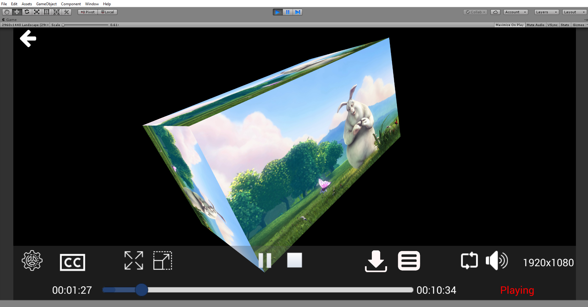
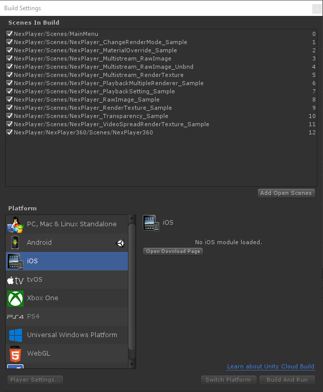

## NexPlayer™ for Unity

### NexPlayer Unity Video Streaming Player Plugin

NexPlayer™ for Unity is a multiscreen video streaming player for Unity apps that supports both standard and 360 video playback across all Android, iOS and PC devices. NexPlayer™ for Unity is the only playback solution for Unity that supports HLS &amp; DASH live streaming with Widevine DRM across all Android & iOS devices.

This repository contains the NexPlayer™ Unity video streaming player plugin features list as well as an integration guide. If you want to get a copy of our fully working demo, contact us at our [website](https://www.nexplayersdk.com/contact?utm_source=github&utm_medium=organic&utm_campaign=unite&utm_content=20190918--unity).

* **[Features](#features)**  

* **[Supported Platforms](#supported-platforms)**

* **[Integration Guide](#integration-guide)**

## Features

The NexPlayer™ for Unity video streaming player plugin contains the latest features. As our Unity video plugin is developed entirely in-house, we can implement any desired functionalities. 

We support the following features:

- Overview
    - Unity Versions 2017 or Higher
    - HLS & DASH Streaming with ABR (Adaptive Bitrate)
    - Widevine DRM on Local Playback and Streaming   
    - Low Latency Live Streaming
    - Up to 4K Ultra High Definition (UHD) Resolution
    - Rendering Videos in 2D & 3D Objects
- Basic Features:
    - Play / Pause
    - Seek
    - Audio Volume Adjustment
    - Loop Playback
    - Configurable Aspect Ratio
    - Portrait / Landscape Orientation
- Advanced Features:
    - Adjustable Buffering Time
    - Offline Streaming Playback for HLS & DASH    
    - SRT, SMI, & WebVTT Subtitles & CEA-608/708 Closed Captions 
    - Multiple Audio & Subtitle Track Selection
    - Content Information and Statistics (Audio & Video Bitrate, Codec, Average FPS, and More)
    - Transparency and Chroma Support
- 360 Video Playback and Virtual Reality (VR)
    - Touch input which includes movement, and camera rotation
    - Gyroscope input to move the camera
    - Mouse input to move the camera
    - Automatic Ground Leveler to stabilize the video
    - Custom shaders to map 2D, 3D Over/Under and 3D Left/Right 360 videos
    - Compatible with VR libraries for Unity (Google Cardboard, Vive & Oculus)

## Supported Platforms

| Platform | Supported Graphics APIs | HLS | DASH | Local | Inside App (Streaming Assets) |
| :-----:| :-----:| :-----:| :-----:| :-----:| :-----:|
| Android  | OpenGLES2, OpenGLES3 | O | O | O | O |
| iOS | OpenGLES2, OpenGLES3, Metal | O | O | O | O |
| Windows | DirectX11 | O | O | O | O |

## Integration Guide

### Quick start
#### 1) Play standard video

Create a new [Unity](https://unity3d.com/) project and import the NexPlayer™ Unity video streaming player plugin.

In order to load the player [Scene](https://docs.unity3d.com/Manual/UsingTheSceneView.html) follow the path: 'Assets/NexPlayer/Scenes' and open 'NexPlayer_RawImage_Sample.unity' by double clicking.
Test the playback by selecting the play button in the editor.

#### 2) Play a 360 scene

Load the 360 Video [Scene](https://docs.unity3d.com/Manual/UsingTheSceneView.html) available in 'Assets/NexPlayer/NexPlayer360/Scenes/NexPlayer360.unity'.
Test the playback by selecting the play button in the editor.

#### 3) Load NexPlayer™ demo

Add the following scenes to the Unity build:

- Assets/NexPlayer/Scenes/MainMenu.unity
- Assets/NexPlayer/Scenes/NexPlayer_ChangeRenderMode_Sample.unity
- Assets/NexPlayer/Scenes/NexPlayer_MaterialOverride_Sample.unity
- Assets/NexPlayer/Scenes/NexPlayer_PlaybackMultipleRenderer_Sample.unity   
- Assets/NexPlayer/Scenes/NexPlayer_PlaybackSetting_Sample.unity
- Assets/NexPlayer/Scenes/NexPlayer_RawImage_Sample.unity   
- Assets/NexPlayer/Scenes/NexPlayer_RenderTexture_Sample.unity   
- Assets/NexPlayer/Scenes/NexPlayer_Transparency_Sample.unity   
- Assets/NexPlayer/Scenes/NexPlayer_VideoSpreadRenderTexture_Sample.unity 
- Assets/NexPlayer/NexPlayer360/Scenes/NexPlayer360.unity

Switch to the desired platform.

#### 4) Configuration steps

Manually select the compatible graphics APIs in the "Player Settings" section of Unity for each platform.

#### Android platform:

- To allow the application to have internet access for streaming videos, select the "Require" value for the "Internet Access" option in the Unity player settings.
- Set "Write Permision" to External (SDcard)
- Make sure to set a specific app ID under "Package Name" as required by Unity before compiling your application.

#### iOS platform:

- To view HTTP videos, enable "Allow downloads over HTTP" option.
- After compilation, in XCode make sure to set a "Signing Team."
- Under embedded binaries, click the "Plus" button and add:
   - widevine_cdm_sdk_release.framework
   - WidevineIntegration.framework

A quick and easy way to enable these settings is by using the helper component
(NexEditorHelper.cs). If the helper component NexEditorHelper.cs is attached to any GameObject, it will include a graphics UI to
auto detect any conflict regarding the graphics API, and it will promptly solve it.

-------------------

## Contact
[supportmadrid@nexplayer.com](mailto:supportmadrid@nexplayer.com)
