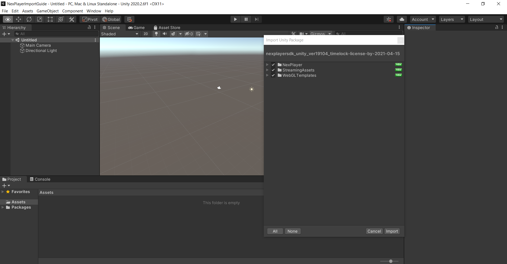
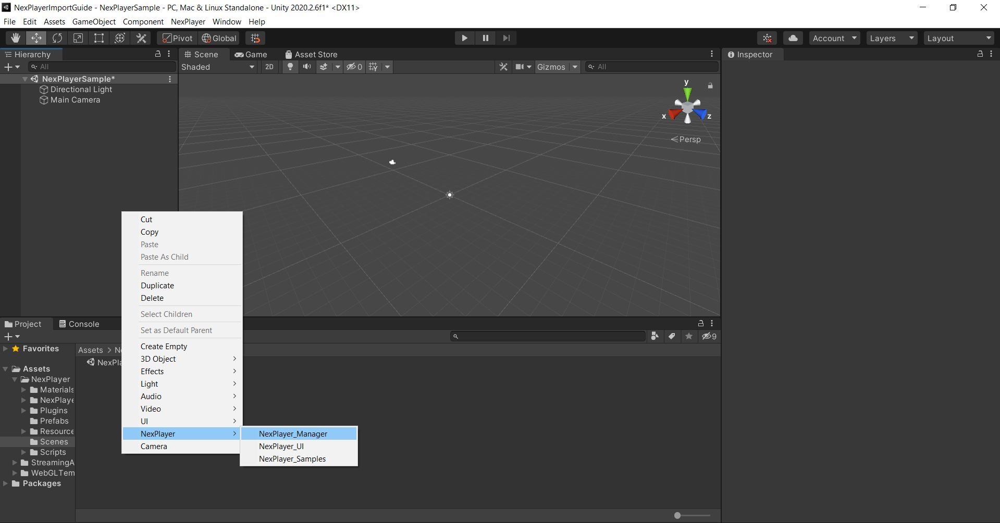
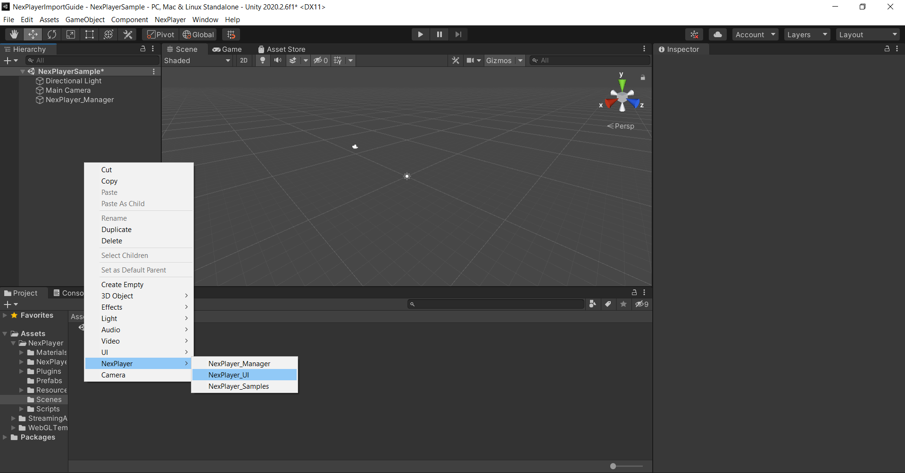
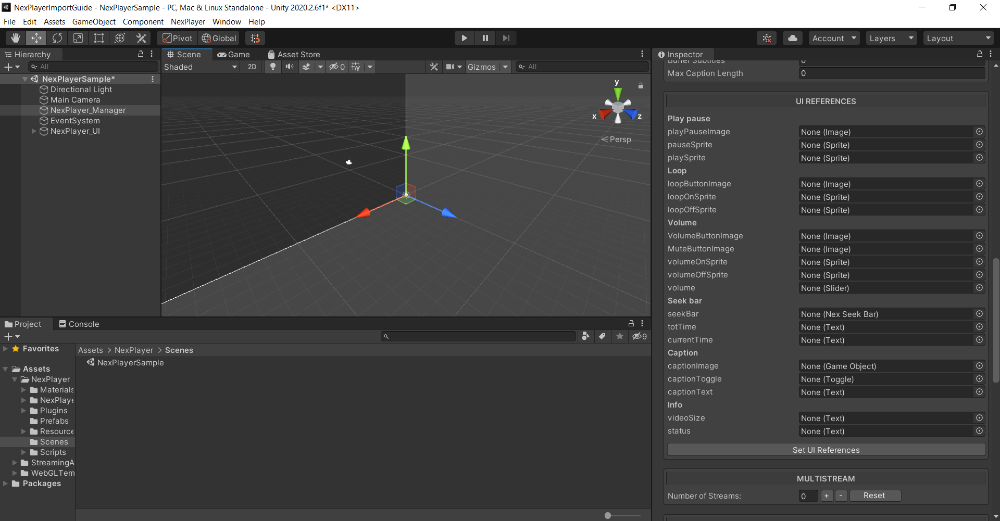
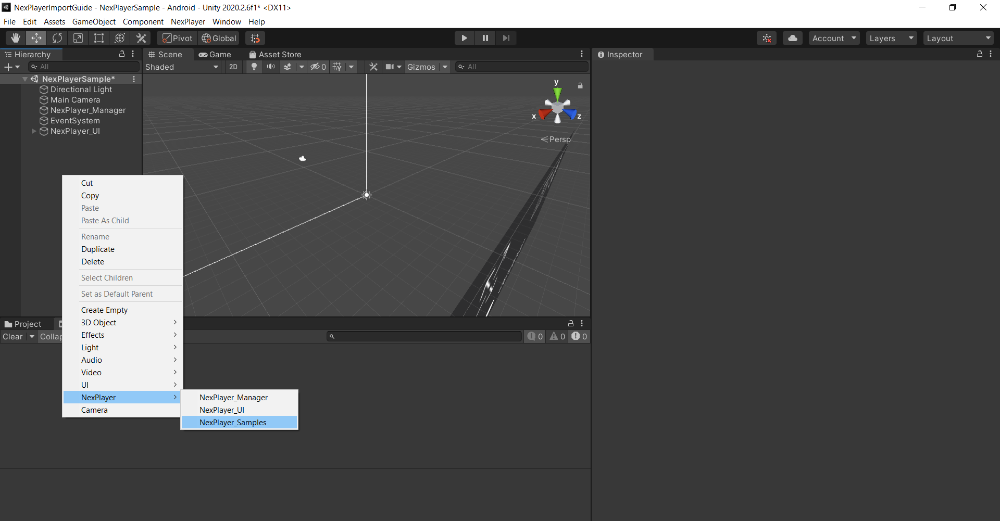
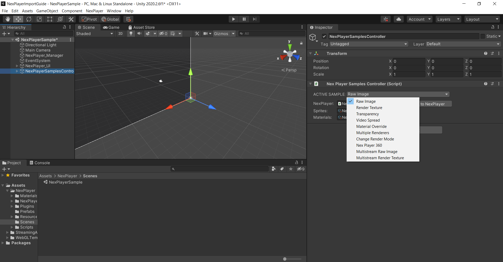

<h1 style="line-height:2;"><p align="center"><a href="https://www.nexplayersdk.com/unity-player-sdk-demo/?utm_source=github&utm_medium=referral&utm_campaign=unitygithub&utm_content=20200211--unitydemocontact" target="_blank"></img></a>
<a align=right href="https://unity.com/es/partners/verified-solutions"></a>
</p></h1>

</br>


NexPlayer™ for Unity is a cross-platform video streaming player for Unity apps that supports both regular and 360 video playback across all Android, iOS, macOS,
and Windows devices, with more devices being worked on everyday. NexPlayer's Unity video plugin is the only player supporting Widevine DRM-protected HLS & DASH streaming on **all Android & iOS devices.**

This repository contains the NexPlayer™ Unity video streaming player plugin features list as well as an installation guide. If you want to get a copy of our fully working demo, contact us at our [website](https://www.nexplayersdk.com/unity-player-sdk-demo/?utm_source=github.com&utm_medium=referral&utm_campaign=unitygithub&utm_content=20200211--unitydemocontact).

## Demo Examples

<p style="margin-left:auto;margin-right:auto" width="300px" align="left">Our Unity video plugin allows for the introduction of new exciting scenes within your Unity projects. With our plugin, you can use in-game actions and objects to modify video content.</p>
 
<p align="center" style="border-style:solid"><a rel="noopener noreferrer"></a>
</p> 
<p align="center"><b>Play videos on any Unity Game Object</b></p> 
<br> 
 
<p align="center" style="border-style:solid">
<a rel="noopener noreferrer"></a>
 </p> 
<p align="center"><b>Multi Streaming</b></p><br> 


## Table of Contents

* **[Features](#features)**  

* **[Supported Platforms](#supported-platforms)**

* **[Demo Installation Guide](#demo-installation-guide)**
 
 <br> 

## Features

The NexPlayer™ for Unity video streaming player plugin contains the latest features. As our Unity video plugin is developed entirely in-house, we can implement any desired functionalities. 

We support the following features:

<table>
 <tbody style="text-align:center;">
   <tr>
     <td valign="top" style="text-align:center;">
         <p style="max-width:100%;"><b>Overview</b></p>
     </td>
     <td>
       <ul>
       <li>HLS & DASH Streaming with ABR (Adaptive Bitrate)</li>
       <li>Widevine DRM for Streaming and Local Playback for Android & iOS</li>
       <li>Server-Side & Client-Side Ad Insertion</li>
       <li>Windows & macOS Editor (Easy to Use)</li>
       <li>Up to 8K (UHD) Resolution</li>
       <li>Rendering Videos on 2D & 3D Objects</li>
       </ul>
     </td>
        <tr>
            <td valign="top" style="text-align:center;">
            <p style="max-width:100%;"><b>Basic Features</b></p>
     </td>
     <td>
       <ul>
        <li>Auto Playback</li>
        <li>Play / Pause</li>
        <li>Seek</li>
        <li>Audio Volume Adjustment</li>
        <li>Loop Playback</li>
        <li>Configurable Aspect Ratio</li>
        <li>Portrait / Landscape Orientation</li>
       </ul>
     </td>
     </tr>
     <tr>
        <td valign="top" style="text-align:center;">
        <p style="max-width:100%;text-align:center;"><b>Advanced Features</b></p>
         </td>
     <td>
       <ul>
       <li>Adjustable Buffering Time</li>
       <li>Low Latency HLS & DASH Streaming</li>
       <li>Offline Streaming Playback for HLS & DASH</li>
       <li>Multi View Streaming (Display Multiple Synchronized Streams)</li>
       <li>SRT, SMI, WebVTT Subtitles & CEA-608/708 Closed Captions</li>
       <li>Multiple Audio & Subtitle Track Selection</li>
       <li>Spread Video Across Multiple Objects</li>
       <li>Content Information and Statistics (Audio & Video Bitrate, Codec, Average FPS, etc.)</li>
       <li>Transparency and Chroma Support</li>
       </ul>
     </td>
     </tr>
      <tr>
        <td valign="top" style="text-align:center;">
        <p style="max-width:100%;"><b>360 Video Playback and Virtual Reality (VR)</b></p>
         </td>
     <td>
       <ul>
       <li>Touch input which includes movement, and camera rotation</li>
       <li>Gyroscope input to move the camera</li>
       <li>Mouse input to move the camera</li>
       <li>Automatic Ground Leveler to stabilize the video</li>
       <li>Custom shaders to map 2D, 3D Over/Under and 3D Left/Right 360 videos</li>
       <li>Compatible with VR libraries for Unity (Google Cardboard, Vive & Oculus)</li>
       </ul>
     </td>
     </tr>
   </tr>
 </tbody>
</table>

## Supported Platforms

| Platform | Supported Graphics APIs | HLS | DASH | Local | Inside App (Streaming Assets) |
| :-----:| :-----:| :-----:| :-----:| :-----:| :-----:|
| Android  | OpenGLES2, OpenGLES3 | :heavy_check_mark: | :heavy_check_mark: | :heavy_check_mark: | :heavy_check_mark: |
| iOS | Metal | :heavy_check_mark: | :heavy_check_mark: | :heavy_check_mark: | :heavy_check_mark: |
| Windows | DirectX11 / DirectX12 | :heavy_check_mark: | :heavy_check_mark: | :heavy_check_mark: | :heavy_check_mark: |
|macOS|Metal|:heavy_check_mark:||:heavy_check_mark:|:heavy_check_mark:|
|HTML 5|WebGL 1.0 / WebGL 2.0|:heavy_check_mark:|:heavy_check_mark:|||

## Demo Installation Guide

### 1) Play Regular Video

<p>Create a new [Unity](https://unity3d.com/) project and import the NexPlayer™ Unity video streaming player plugin.</p>
</img><br>


<p>Create the NexPlayer_Manager GameObject by either using the NexPlayer Context Menu at the top or right clicking in the Hierarchy (Object Context Menu).</p>
</img><br>


<p>Create the NexPlayer_UI GameObject using the NexPlayer™ Context Menu.</p>
</img><br>


<p>Set NexPlayer_Manager references to the UI elements by clicking on the button “Set UI References”.</p>
</img><br>


<p>Create the NexPlayer Samples Controller GameObject using the NexPlayer™ Context Menu.</p>
</img><br>


<p>Select any of the different samples provided by NexPlayer™.</p>
</img><br>


<p>Finally, Change the NexPlayer™ component inside NexPlayer_Manager with the desired stream settings.</p>


### 2) Play a 360 Scene

Select the value Nex Player 360 for the Active Sample setting at the Samples Controller GameObject.


### 3) Load Any NexPlayer™ Sample Demo

Select any of the following samples as the Active Sample setting at the Samples Controller GameObject.

```cs
- Raw Image
- Render Texture
- Transparency
- Video Spread
- Material Override
- Multiple Renderers 
- Change Render Mode
- NexPlayer360
- Multistream Raw Image  
- Multistream Render Texture  
```

Add the Scene to the list and switch to the desired platform.


### 4) Configuration Steps

Manually select the compatible graphics APIs in the "Player Settings" section of Unity for each platform.

#### Android Platform:

- To allow the application to have internet access for streaming videos, select the "Require" value for the "Internet Access" option in the Unity player settings.
- Set "Write Permission" to External (SDcard)
- Make sure to set a specific app ID under "Package Name" as required by Unity before compiling your application.

#### iOS Platform:

- To view HTTP videos, enable "Allow downloads over HTTP" option.
- After compilation, in XCode make sure to set a "Signing Team."
- Under embedded binaries, click the "Plus" button and add:
   - widevine_cdm_sdk_release.framework
   - WidevineIntegration.framework

A quick and easy way to enable these settings is by using the helper component
(NexEditorHelper.cs). If the helper component NexEditorHelper.cs is attached to any GameObject, it will include a graphics UI to
auto detect any conflict regarding the graphics API, and it will promptly solve it.


## Frequently Asked Questions

To view the FAQ proceed to the [Unity Support Page](https://support.unity.com/hc/en-us/sections/360011703472-NexPlayer-Verified-Solutions-Partner-)

-------------------


## Contact
[support.madrid@nexplayer.com](mailto:support.madrid@nexplayer.com)
<br>+34 914 184 356
